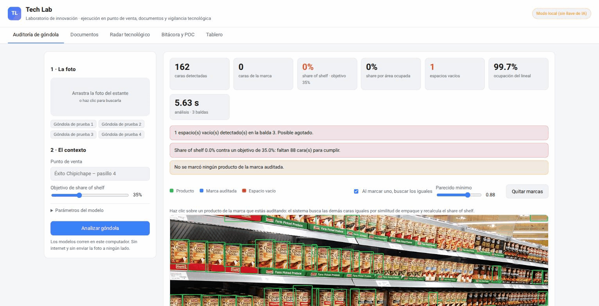

# Ángel Farid Agreda Vargas

Estudiante de 8° semestre de Ingeniería de Sistemas (Universidad Libre, Cali, Colombia). Construyo proyectos completos —backend, datos, IA aplicada— para aprender resolviendo problemas reales, no solo tutoriales.

Busco práctica en desarrollo, datos o IA aplicada — presencial en Cali o remoto.

## Proyectos

| Proyecto | Qué hace |
|---|---|
| [**techlab**](https://github.com/angelfvargas/techlab) | Laboratorio de innovación que corre sin nube: auditoría de góndola con visión computacional (ensamble de 2 modelos YOLO), OCR de documentos, radar de tendencias en IA y bitácora automática. |
| [**talentpilot-ai**](https://github.com/angelfvargas/talentpilot-ai) | Compara un CV contra una oferta de empleo real y dice qué ajustar antes de postular. Python puro, sin dependencias. |
| [**ats-practicas**](https://github.com/angelfvargas/ats-practicas) | API REST en FastAPI + SQLite para seguir postulaciones de práctica: vacantes, empresas, historial de estados y puntaje automático. 71 pruebas. |
| [**mercado-energia-xm**](https://github.com/angelfvargas/mercado-energia-xm) | Análisis del mercado eléctrico colombiano con datos públicos de XM: precio de bolsa, contratos, hidrología. |
| [**conectividad-co**](https://github.com/angelfvargas/conectividad-co) | Descarga y analiza los datos de internet fijo en Colombia desde la API de datos.gov.co (MinTIC). Sin dependencias. |
| [**sesenta**](https://github.com/angelfvargas/sesenta) | Diagnóstico de un servidor Linux en un solo comando: recoge sistema, almacenamiento, red y servicios, y concluye una causa con el método USE. |
| [**postula**](https://github.com/angelfvargas/postula) | Envía correos de postulación personalizados con CV adjunto, sin escribirle dos veces a la misma empresa. |

### Tech Lab en acción

## Stack

**Uso en producción propia:** Python · SQL · Git/GitHub · Linux

**Inteligencia artificial:** TensorFlow/Keras, redes neuronales convolucionales (CNN), fundamentos de LLM

**En profundización:** React · TypeScript · FastAPI · PostgreSQL

## Formación

- Ingeniería de Sistemas — Universidad Libre, Cali (2022–2026)
- Bootcamp de Inteligencia Artificial — MinTIC (159 h)
- Cisco Networking Academy — redes y ciberseguridad

## Contacto

[LinkedIn](https://www.linkedin.com/in/angel-farid-agreda-vargas-9a681b201) · angelf-agredav@unilibre.edu.co
